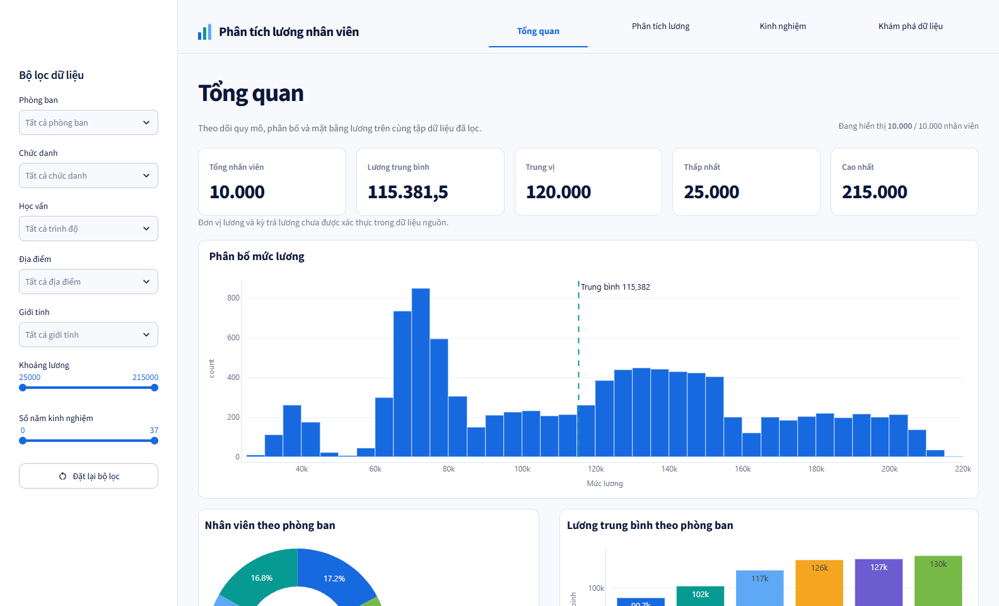
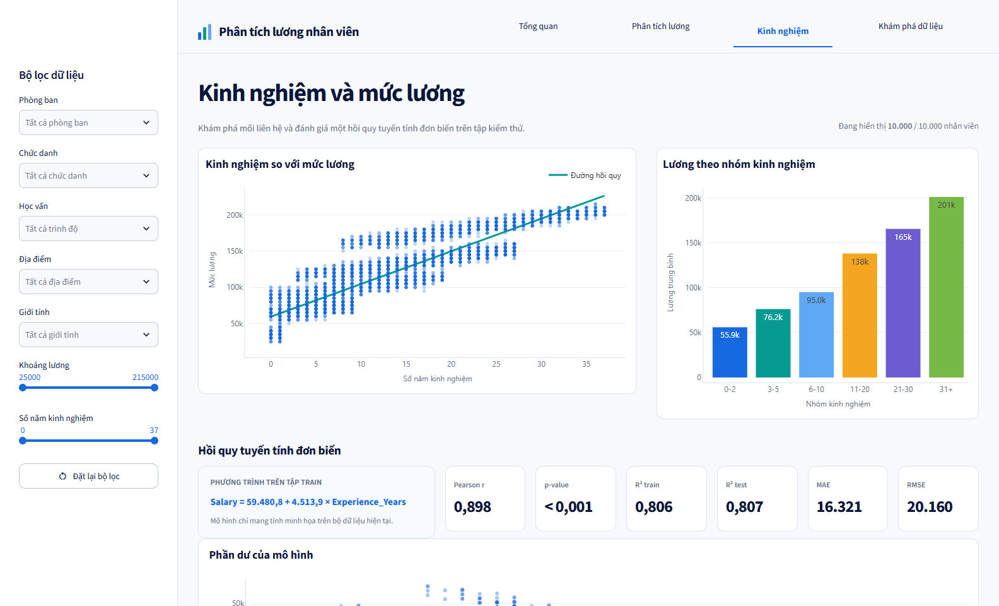
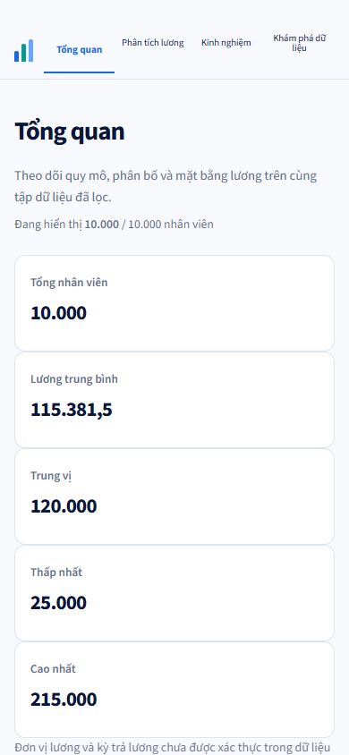

# Báo cáo dự án Phân tích lương nhân viên

## 1. Bài toán

Dự án xây dựng dashboard Streamlit để mô tả phân bố lương, so sánh các nhóm nhân viên, tra cứu/xuất dữ liệu và minh họa mối liên hệ tuyến tính giữa số năm kinh nghiệm với mức lương. Sản phẩm hướng tới mục đích học tập và khám phá dữ liệu; không dùng để quyết định lương hoặc đánh giá nhân sự.

## 2. Dữ liệu

Nguồn đầu vào là `Employers_data.csv`, gồm 10.000 dòng và 10 cột. Mỗi dòng đại diện cho một nhân viên; `Employee_ID` là khóa duy nhất. Audit không phát hiện giá trị thiếu, dòng trùng hoàn toàn hoặc ID trùng. `Salary` nằm trong khoảng 25.000–215.000 và chỉ có 39 mức, đều là bội số của 5.000.

Đơn vị tiền tệ, kỳ trả lương, nguồn gốc và phương pháp thu thập chưa được xác thực. Vì vậy, mọi kết luận chỉ mô tả bộ dữ liệu hiện tại và không đại diện cho thị trường lao động.

## 3. Phương pháp

Quy trình gồm các bước:

1. Kiểm tra schema, kiểu dữ liệu, missing value, trùng lặp và miền giá trị.
2. Tạo nhóm tuổi và nhóm kinh nghiệm bằng các biên được ghi rõ trong data dictionary.
3. Tính KPI và tổng hợp mean, median, min, max, độ lệch chuẩn cùng cỡ mẫu theo nhóm.
4. Trực quan bằng histogram, bar chart, donut chart, box plot và scatter plot.
5. Tính Pearson correlation cho `Experience_Years` và `Salary`.
6. Chia train/test 80/20 với `random_state=42`, fit hồi quy tuyến tính đơn biến trên train và đánh giá bằng R², MAE, RMSE trên test.

## 4. Thiết kế và triển khai

Ứng dụng gồm bốn trang:

- **Tổng quan:** KPI, phân bố lương, quy mô và lương trung bình theo phòng ban.
- **Phân tích lương:** so sánh phòng ban, chức danh, học vấn, địa điểm và box plot.
- **Kinh nghiệm:** scatter plot, Pearson correlation, hồi quy tuyến tính, residual plot và phân tích tuổi.
- **Khám phá dữ liệu:** filter, tìm kiếm, chọn cột và tải đúng CSV đang hiển thị.

Sidebar được dựng tại entrypoint chung để filter giữ nguyên khi chuyển trang. Toàn bộ KPI, biểu đồ, bảng và CSV export đều nhận cùng dataframe sau lọc.



*Hình 1. Trang Tổng quan trên desktop với bộ dữ liệu đầy đủ.*



*Hình 2. Phân tích kinh nghiệm và hồi quy tuyến tính đơn biến.*



*Hình 3. Bố cục responsive trên viewport 390 × 844.*

## 5. Kết quả chính

Trên toàn bộ dữ liệu, lương trung bình là 115.381,5; trung vị 120.000; thấp nhất 25.000 và cao nhất 215.000. Mean theo chức danh tăng từ khoảng 35.802 ở Intern lên 183.415 ở Executive. Mean theo địa điểm chỉ dao động khoảng 113.437–116.649, nhỏ hơn đáng kể so với chênh lệch theo chức danh.

Kinh nghiệm có tương quan tuyến tính mạnh với lương: Pearson `r = 0,898025`, `p < 0,001`. Mô hình thu được:

```text
Salary = 59.480,83 + 4.513,90 × Experience_Years
```

R² train là `0,806261`, R² test `0,807168`, MAE test `16.321,09` và RMSE test `20.160,00`. Khoảng cách train/test nhỏ cho thấy kết quả ổn định trên lần chia cố định này, nhưng một lần chia không thay thế cho đánh giá trên dữ liệu độc lập.

Age–Salary có `r ≈ 0,928`, trong khi Age–Experience có `r ≈ 0,982`. Hai biến tuổi và kinh nghiệm gần như mang thông tin trùng nhau; không thể diễn giải chúng như hai nguyên nhân độc lập.

## 6. Kiểm thử và triển khai

Test tự động bao phủ loader/schema, KPI, filter kết hợp, nhóm phân tích, biểu đồ, audit, benchmark và hồi quy. Kiểm thử trình duyệt xác nhận filter Engineering giữ đúng 1.683 bản ghi khi chuyển trang; file CSV export có đúng 1.683 dòng và chỉ chứa Engineering. Giao diện được kiểm tra ở desktop 1584 × 960 và mobile 390 × 844 mà không có Streamlit exception hoặc console error.

Người dùng xác nhận phiên bản hiện tại đã được deploy thành công. URL triển khai chưa được ghi trong repository.

## 7. Giới hạn và rủi ro

- Chưa xác thực nguồn, đơn vị và kỳ lương.
- Salary có cấu trúc rời rạc, có khả năng được tổng hợp hoặc sinh theo quy tắc.
- Cơ cấu chức danh không giống nhau giữa mọi phòng ban/học vấn, nên so sánh nhóm có thể chịu ảnh hưởng của biến gây nhiễu.
- Tương quan và hồi quy không chứng minh quan hệ nhân quả.
- Dữ liệu có `Name`, tuổi và lương; cần xác nhận dữ liệu là giả lập hoặc ẩn danh trước khi chia sẻ công khai.
- Mô hình chỉ dùng một biến và một lần chia train/test cố định; không phù hợp cho quyết định nhân sự thực tế.

## 8. Kết luận

Dashboard đáp ứng mục tiêu mô tả, so sánh, lọc, tra cứu và minh họa hồi quy tuyến tính trên bộ dữ liệu 10.000 nhân viên. Kết quả nổi bật là mối liên hệ mạnh giữa kinh nghiệm và lương trong chính dữ liệu này, với R² test khoảng 0,807. Giá trị của sản phẩm nằm ở khả năng tái lập và khám phá có kiểm soát, không phải dự báo lương ngoài bối cảnh dữ liệu nguồn.
